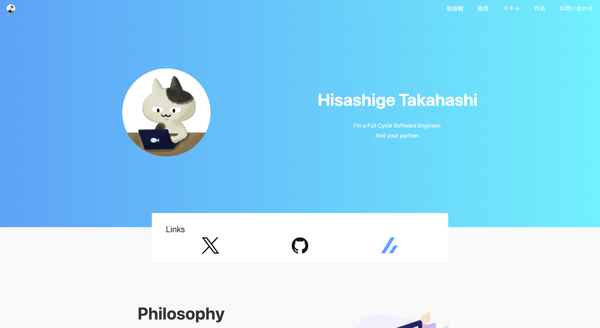

# Hisashige Takahashi のポートフォリオサイト



microCMS 公式のシンプルなコーポレートサイトのテンプレートです。
サイト内のお問い合わせ送信先として CRM である [HubSpot](https://www.hubspot.jp/) を利用しています。

## 動作環境

Node.js 18 以上

## 開発の仕方

1. パッケージのインストール

```bash
yarn
```

2. 開発環境の起動

```bash
yarn dev
```

3. 開発環境へのアクセス  
   [http://localhost:3000](http://localhost:3000)にアクセス
